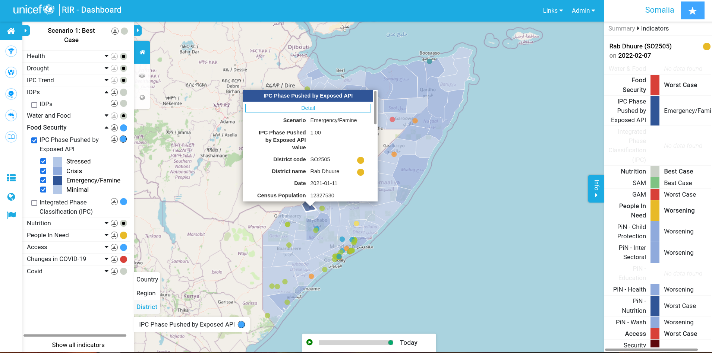

# Introduction

## What is the Risk Informed Response platform?

The platform provides a way to understand risk modalities across different geographic contexts. Some key features include:

* **Traffic light** system to show an at a glance status for each risk indicator
* **Program intervention** system which shows the traffic light status across different programmes such as health, security etc.
* Side-by-side comparison of risk factors (indicators) using a **map swiping** tool
* **Indicators** - risk factors which can be harvested form external sources and displayed in the map and dashboard
* **Interactive map** - click, drag, drill down into information on the map and open corresponding dashboards and details
* **Harvesters** that can automatically update indicators from different data sources such as web API's
* a complete and **user friendly administration** environment to manage the system
* Role based **user management**
