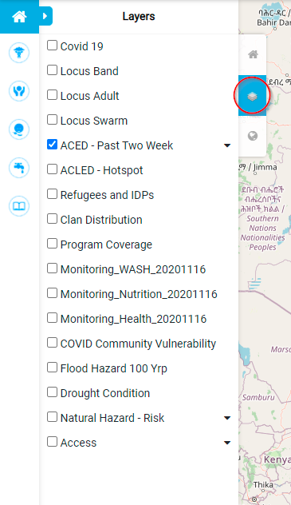
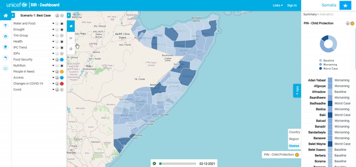
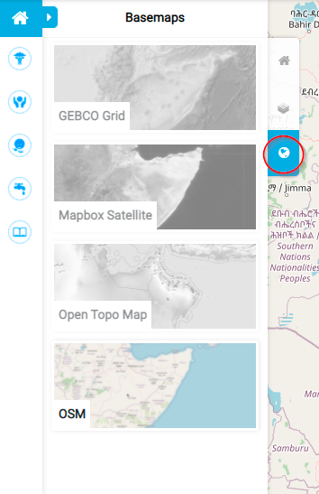

# Layers

A layer represents geographic data that can be represented on a map as either a point, line, polygon or pixel value from and image. 
The Layers in the dashboard are grouped into themes for example, access which includes layers like ports and roads. 
Examples of map layers also include political boundaries, Covid hotspots, schools or even orthophoto imagery. 
Each layer is a visual representation of a dataset.

## Context Layers

Underneath the indicators tab is the layers tab. 
By clicking on this, you open a display of different layers that you can activate to be displayed on the map canvas.

The Layers show on the map canvas above the indicators. 
If the layer activated is a polygon layer, you won’t be able to see which indicators are active underneath and therefore need to switch between layers and indicators.

## Basemap

A basemap provides background detail necessary to orient the location of the map as well as other geographic phenomena such as topography or boundaries for example. 
Additionally, basemaps contribute to the aesthetic of a map. 
Below the context layers tab is the Basemap tab. 
If you click on this tab, a selection of various basemaps will be displayed for you as the user to choose from.

The default basemap that’s on the map canvas is OSM which is ‘open street map’. 
There is also a GEBCO grid basemap which is a global terrain model for ocean and land, a mapbox satellite basemap and an open topo basemap which is rendered from OSM and SRTM data.

 
