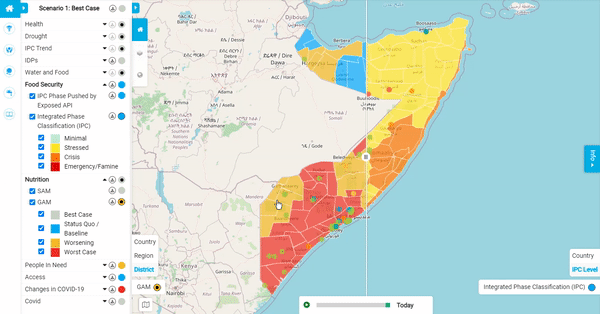
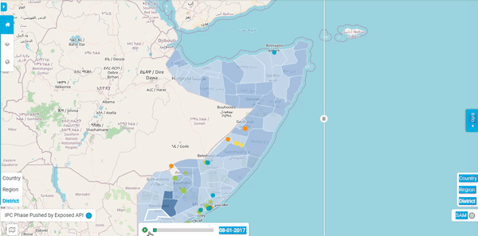

# Map Interactions

This document covers how you can interact with the map displayed in the RIR dashboard
and how the user can navigate around to perform different functions and obtain different information.

## Moving Around the Map

To "pan" around the map, you need to "click" down with your mouse and "drag" the map around.
The map will continue to pan for as long as the mouse is clicked in.
To make the map stop moving, "release" your mouse.

## Zooming In and Out

There are two ways to zoom in and out.
The first is that you can use your scroll on their mouse to zoom in and out.
This is the easier of the two methods.
The second method can be used when you are looking to zoom into a specific area.
This method requires the user to "click", "shift" and then "drag" a square around the area they would like to focus in on.
If you are using a scroll pad and not a mouse, you can zoom out by bringing your fingers together on your trackpad and zoom out by moving them away from each other on your trackpad.

## Information Display Window

To gain information on a specific area within the map, "click" on that area with your mouse.
By clicking on an area, a popup window with information related to your selected layers for that area will be displayed on the screen.
This action will also change the info window in the ‘Summary Tab' to the ‘Indicators Tab'.
You can also view more details by "clicking" on ‘details’ in the popup window. This will also change the info window’s tab to the ‘Details Tab'.

## The Slide Deck

If you have two indicators selected to display on the map at the same time, it will turn to be compare mode.
You will see the name and severity levels on the bottom right and left of the screen indicate the side of indicators.
To move between the two sets of data "drag" the vertical line, that extends from the top of the screen to the bottom, left to right.
This feature allows the user to analyse more than one indicator at a time without having to deselect and select another indicators.

By clicking on the little map icon at the bottom left of the screen, you can change the slide deck function from vertical to horizontal.

## Timelapse Bar

The Timelapse Bar will show you the severity of the selected indicator over a period of time.
As the map and the info panel change, the corresponding date for that data will be displayed within the bar.
You can slide the green bar to select the date, or you can start autoplay by "clicking" on the "play" button.
"Click" "stop" to stop the autoplay.

## Administrative Level

Every indicator has administrative levels that we can select. By default, it will select the lowest administration level.
To change it, you can click one of level on the right-bottom list of levels (left-bottom for second indicator in compare mode).
The corresponding selected "indicators" data for the selected level will be displayed in map in also in sidebar. 