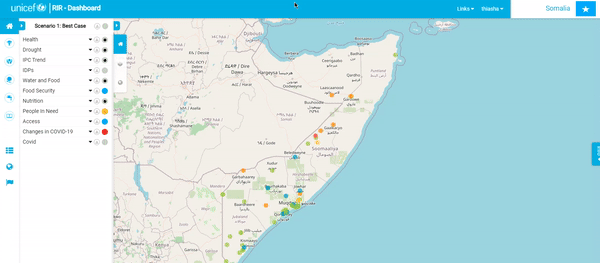

# Geography Management

## Adding a Geography level

Let’s start in  **Site Administration**. Scroll down to Geometry Level Instances and select **+Add**. Add the name and description to your instance. Go back to the main page of your instance. Below the Program Interventions panel are three
icons; ‘Indicator Management’, ‘Geography Management’, and ‘Instance Management’.
Click on the **Geography Management** icon. You will be redirected to the ‘Geography View’ map page, and you will see that in the top right corner there is an **+uploader** button. Select this button and start filling in the form. The first
thing you need to do is add the data for the geography level. Once the data is uploaded, you will be able to fill in the rest of the form. Please note that the country level does not have a parent level.   

## Geography Level Arrangement

Click on the **Geography Management** icon. You will be redirected to the ‘Geography View’ map page, and you will see that in the top right corner there is a button
for **Level Management**. Select this button. Now you will be able to rearrange the geography level by clicking on a degree and dragging it to your desired location.

