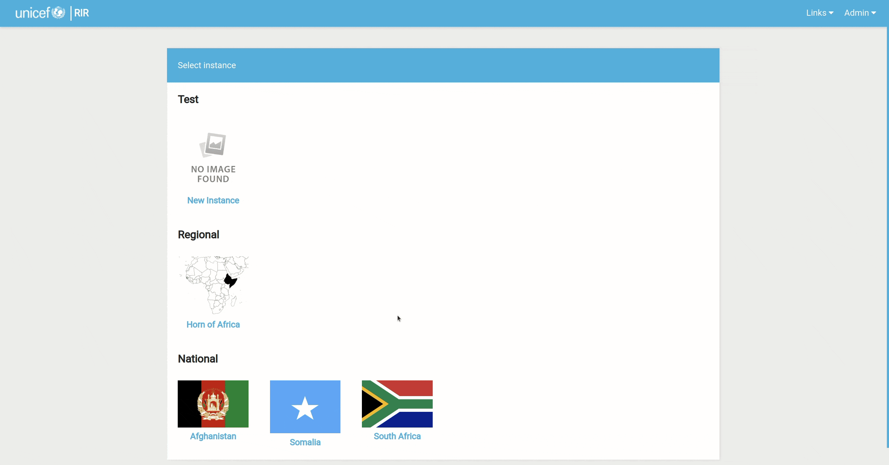

# Instances

To access the dashboard, we need to have an instance.

## Creating an instance

Once you’ve signed in, you’ll be redirected back to the home page which contains the various instances that you can select.

To create a new Instance, select the dropdown arrow next to your username and click on **Django Admin**. Once you’re on the Site Administration page, scroll down until you find ‘Instances’.
Click on the **+Add** option on the right-hand side of the Instances row. Add the name of the new instance, a description as well as the icon files
and then click **Save**.

You also can add it to a category. To do it, just select the category or add a new one by clicking the **plus** icon.

## Change the order of categories

Sometimes we need to change the order of the categories. For example from before, we need to change the order of the ‘Test‘ category to the bottom. To do it, go to the **Site Administration** page,
and scroll down to Instance Categories. There will be an order column. Just change the number for the orders of category.

