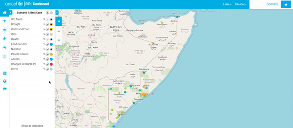

# Navigation Link

To add links to the RIR platform or a specific instant, go to **Django Admin** and click on **RIR data**. Select **Links** and fill out the necessary information.
If you leave the instance option blank, the link will show in Navigation for all instances. If you select an instance, the link will only appear in Navigation
for that instance.

  
