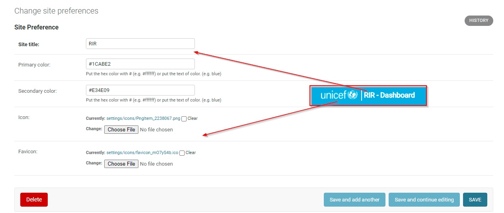

# Preferences

This document is about how to change preferences of the website. Mostly it is about how to change text and the theme.

## Website Preferences

To change or add icons to the RIR dashboard panel at the top of the screen, you will need to go to the **Site Administration** page. Under the group **Core**,
you will see **Site Preferences**. Click on this option, and then you will be redirected to a new page, select **Site Preferences** again. 
Here you will be able to change or edit the title as well as the icons. Save and refresh once you have made your edits.

### Site title
This is used for the title of site on top navigation bar.

### Primary color 
:octicons-milestone-24: Default:  #1CABE2

This color is used for the theme of the website. For example : navigation bar.

### Secondary color 
:octicons-milestone-24: Default:  #E34E09

This color is used for the secondary theme of the website. 

### Icon
The image that is used for the website icon. Used on the navigation bar for example.

### Favicon
The image that is used for the favicon of the website. The image will be checked on the icon on the browser tab.

