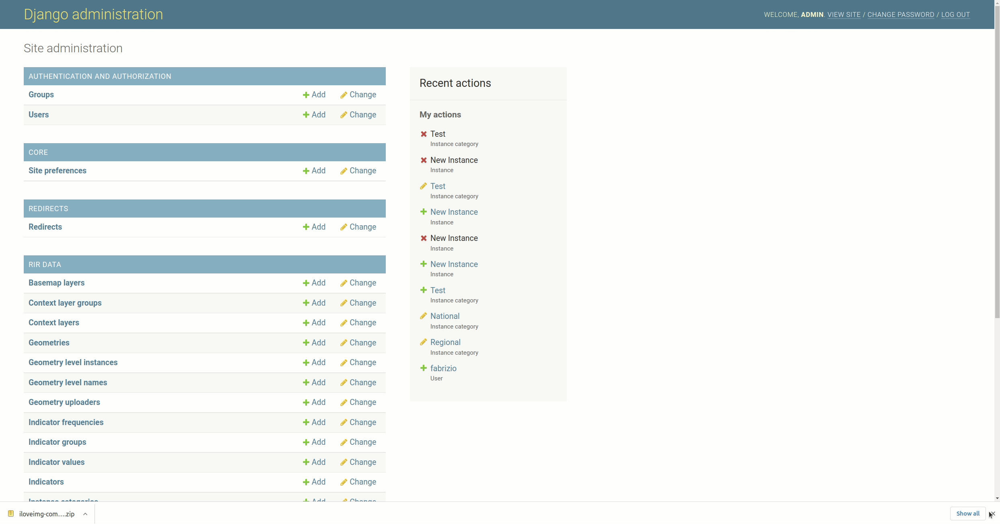
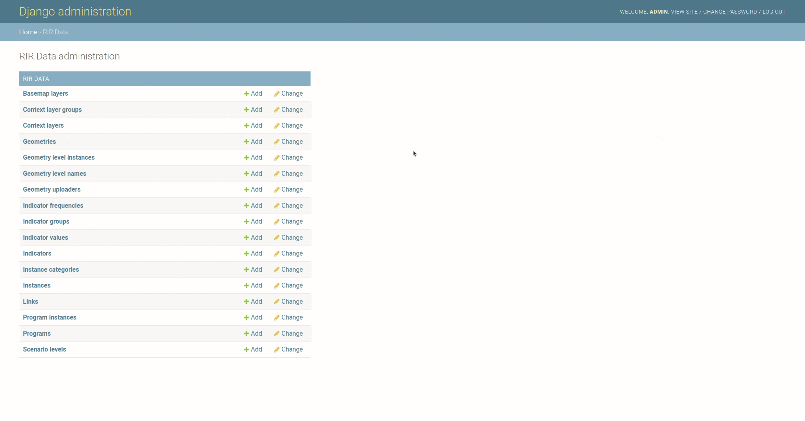

# Program Interventions

After we change the scenario, we need to create a program, so we can create a program intervention.
To add or edit a program, go to the **Site Administration** page, select **Program**. In the form, you can fill name, icon and white icon.

Now we need to add the program to an instance, so we can create an intervention for the program on the instance for a specific scenario. 
To do it, go to the **Site Administration** page, select **Program instances** and create a new or edit the existing one.
It will ask about the instance and also the program. And also we need to add the program interventions that link to a specific scenario.

