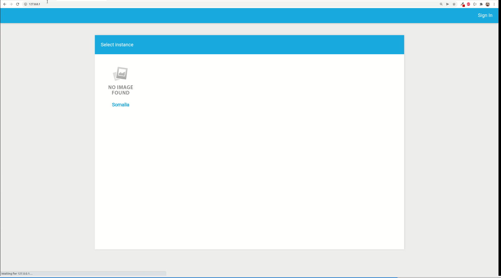

# Project Setup

## Clone rir-dashboard repository

This will clone the rir-dashboard repository to your machine
```
git clone https://github.com/kartoza/rir-dashboard.git
```

## Set up the project

This will set up the rir-dashboard project on your machine
```
cd rir-dashboard
cd deployment
cp docker-compose.override.template.yml docker-compose.override.yml
cp .template.env .env
cd ..
make up
```
Wait until everything is done.

After everything is done, open up a web browser and go to [http://127.0.0.1/](http://127.0.0.1/) and the dashboard will open:



By Default, we can use the admin credential:
```
username : admin
password : admin
```

## Set up different environment
To set up different environment, for example the Default credential, or the port of server, open **deployment/.env**.
You can check the description below for each of variable.

```
COMPOSE_PROJECT_NAME=rir_dashboard
NGINX_TAG=0.0.1  -> Change this for different nginx image
DJANGO_TAG=0.0.1 -> Change this for different django image
DJANGO_DEV_TAG=0.0.1 -> Change this for different django dev image

# Environments
DJANGO_SETTINGS_MODULE=core.settings.prod -> Change this to use different django config file
ADMIN_USERNAME=admin -> Default admin username 
ADMIN_PASSWORD=admin -> Default admin password
ADMIN_EMAIL=admin@example.com -> Default admin email
INITIAL_FIXTURES=True
HTTP_PORT=80 -> Change the port of nginx

# Database Environment
DATABASE_NAME=django -> Default database name
DATABASE_USERNAME=docker -> Default database username
DATABASE_PASSWORD=docker -> Default database password
DATABASE_HOST=db -> Default database host. Change this if you use cloud database or any new docker container.
RABBITMQ_HOST=rabbitmq

# Onedrive
PUID=1000
PGID=1000
```

After you change the desired variable and do `make up`. It will rerun the project with new environment.