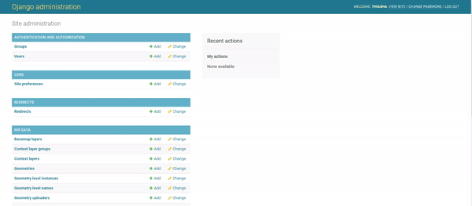
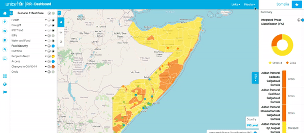

# Administrator Tutorial

## Introduction

🧑‍🏫 The RIR (Risk Informed Response) platform is a situational awareness platform to monitor health, child protection, nutrition, wash and education in a geographic region. This tutorial shows you how to manage the platform as an administrator.


### Working with this documentation

Whenever you see a phrase in **bold**, it refers to a link or button on the user interface that you can interact with.

### Important Links

* [RIR Platform](https://staging.rir.kartoza.com/ "RIR Platform")
* [RIR Full Documentation](https://kartoza.github.io/rir-dashboard/ "RIR Full Documentation")  

## Session Outline

This session is divided into two parts:

1. General Platform Administration
   * User Management: Creating and editing user profiles.
   * Managing Instances: Creating new and editing preexisting instances.
   * Managing Context Layers: Using layers that you have uploaded to GeoNode or GeoServer to create a context layer in the platform.
   * Geography management: Adding geography levels to your instance.


2. Indicator Administration

   * Indicator management: Adding indicators to the dashboard.
   * Forms: used to manually capture indicator data by filling in forms.
   * Ingestors: Used to manually import data by uploading.
   * Harvesters: Automatic agents that fetch data and add it to indicators on a regular basis.


 
## Session Tutorial

### **Signing In**

In the top right-hand corner of the screen is the **Sign In** button. Here, you will sign in using your admin username and password. This process is the same for a staff user and an admin user.  


### **Users and Permissions**

Next we will look at how to manage users. Go to site administration by clickng **Admin -> Django Admin**. Click on **+Add** in the same row as ‘Users’. You can now create a profile for someone by adding a username and password. Once you have created the user profile, click **Save**.



Once you have created the user account, go back to Site Administration and select the **User** option. Select the user you created and then you can edit their personal information as well as select or deselect their permission status. Remember to **Save** your changes.


> 📒 **Note**: If you want to make a user an admin user so that they can carry out the activities described in this tutorial, you should assign them to the **Staff** group, the **Super User** group and the **Active** box should be checked.


### **Creating an instance**

🧑‍🏫 Once you’ve signed in as an admin user, you will be redirected back to the home page which contains various instances. To create a new instance, select the dropdown menu next to your username and click on **Django Admin**. Once you’re on the Site Administration page, scroll down until you find **Instances**.

👨‍🏫 Click on the **+Add** button on the right-hand side of the Instances screen. Add the name of the new instance that you would like to create, a description, as well as the icon file. The icon file in most cases would be a flag of the country for the instance. Once you have added all of the information, click **Save**.


 For this tutorial, we will create a demonstrator instance for South Africa, :

 

 > **Note:** You can find all of the sample data used in this tutorial (including this flag image) [](here) XXXXXX Thiasha to make XXXXX.

Once your new instance is created, you will be able to open it from the instance chooser. It will appear very empty, like this:

 

### **Adding a new Context layer**

🧑‍🏫 In this section we will explain how to create and manage context layers. What is a context layer? Context layers are shown on the map to provide a sense of the conditions in the region. They can cover any topic - for example, security, food security, infrastructure etc. Context layers do not have indicator data attached, they are a visual aid in the dashboard map. Context layers are normally hosted on another server e.g. ArcGIS Online, GeoServer, GeoNode all provide ways to publish context layers.

To add a context layer to the RIR instance, you will need a link to an online layer. For this exercise will be adding a context layer showing homelands:


👨‍🏫 To find the link to an online layer so that you can copy it over and create your layer in the RIR Dashboard, Right-click on the browser page, click on inspect and then select network. Hard refresh your creen and look through the url links until you see the layer url. this is the url that you need to copy.


XXX Thiasha ask Irwan to make a css rule so we get a copy button on hover over a code block

```https://staging.osgs.rir.kartoza.com/geoserver/ows?access_token=SWMqWx64T5dOsNwPD72o4uIbtZ7FIA&LAYERS=geonode%3Aformer_homelands_polygon&TRANSPARENT=TRUE&SERVICE=WMS&VERSION=1.1.1&REQUEST=GetMap&STYLES=&FORMAT=image%2Fpng&SRS=EPSG%3A900913&BBOX=2504688.5425,-3757032.81375,3757032.81375,-2504688.5425&WIDTH=256&HEIGHT=256
```

XXXX Thiasha ask Irwan to fix this so the replace step is not needed, then remove the next paragraph. XXXX

👨‍🏫 Now we can create the context layer in the RIR platform.
Copy the link address above and paste it into a notepad and change all the words in full capital letters to lower case letters. 

Use this link address as the URL when adding a new layer.  
Click on your account menu in the top right corner of the RIR platform and open **Django Admin**. Click on **+Add** on the Context layers line. Select the instance you would like to add the context layer to.


We will use the instance that we have just created, South Africa. Enter the information in the form as shown in the images below and save the form once you are happy with it.


Click on **Veiw Site** to see your new layer. You will be able to see your new layer in the **Layers** menu. There is also an option to add other parameters to this layer.



## Geography Management

### **Adding a Geography level**

🧑‍🏫 Geography levels express the heirarchy between administrative boundaries. For example in South Africa we have the national boundary subdivided into provinces, which are in turn subdivided into districts, then municipalities. RIR uses these geography levels to provide a sense of the conditions in the region.

👨‍🏫 Let’s start in  **Site Administration**. Scroll down to **Geometry Level Instances** and click **+Add**. Set the name and description to your instance. Go back to the main page of your instance. Below the **Program Interventions** panel are three icons; **Indicator Management**, **Geography Management**, and **Instance Management**.

Click on the **Geography Management** icon. You will be redirected to the geography view map page and you will see that in the top right corner there is an **+uploader** button. Select this button and start filling in the form. The first thing you need to do is add the data for the geography level. Once the data is uploaded, you will be able to fill in the rest of the form.  


> 📒 **Note:** You can find all of the sample data used in this tutorial here: [Data](https://github.com/ThiashaV/rir-dashboard/blob/develop/documentation/docs/assets/tutorial_data/Training_Data.zip "Data")


For a province level, the code column is 'code', the name column is 'name' and the parent code column is 'pcode'. The country does not need parent, but we need the code for a country level. In here, the country is ZA (under 'adm0_pcode')


### **Adding a New Indicator**

🧑‍🏫 Indicators are special layers in RIR that are linked to the situation in the region. Indicators are used to show the situation in the region. For example, in South Africa, there are indicators for the number of people living in poverty, the number of people living in extreme poverty, the number of people living in extreme poverty and the number of people living in extreme poverty and the number of people living in extreme poverty and the number of people living in extreme poverty.

👨‍🏫 To add an indicator, click on **Indicator Management** on the main platform page for the instance and go to **Create New**. Fill in the necessary information about the indicator you would like to create.

Once you have filled out the form, scroll down to **Scenario Rules** and add the parameters to match the indicator. you can also change the colour for each rule by clicking on the colour block. Click **Submit** once you are happy with the added information and scenario rules. If you add a dashbord link, you will see a black dot in the centre of the cirlce that represents the scenario case on that indicator in the Program Interventions panel. By clicking on the black dot, you will be redirected to the dashboard link.
 


Once we have created an indicator, we need to populate it with data. THere are three ways to do this.

1. We can manually add the data using the value manager form or map.
2. We can use an ingestor to import data from a spreadsheet.
3. We can use a harvester to automatically fetch the data from an online resource.

### **Value Manager Form**

The value manager form is a table with cells and rows, one row per administrative boundary and one cell per indicator.

👨‍🏫 Let's look at how to use the Value Manager Form. To access this form, go to **Indicator Management** and scroll to the indicator that you would like to add data to. On the right-hand side of the indicator's name, there will be a small **Settings** symbol.
Click on **Settings** for the desired indicator and then click on **Value Manager Form**. You will be redirected to a form that gives you all the geographic locations within the instantce and spaces to add values. You can also add a file to fill in the data by clicking **Use File to Refill Form**


### **Value Manager Map**

The value manager map allows you to add data by directly clicking on the region of the map that you would like to add data to.

👨‍🏫 The second way to add data to an indicator is through the Value Manager Map option. Go to **Indicator Management** and scroll to the indicator that you would like to add data to. On the right-hand side of the indicator's name, there will be a small Settings symbol. Click on **Settings** for the desired indicator and then click" on **Value Manager Map**. This will take you back to the map canvas. Now you will be able to click on any geographic location within the instance and a popup window will appear which will allow you to fill in value data for that location.


### **Ingestors**

The function of an ingestor is to manually upload data which is then automatically ingested or pushed from a remote side. 

👨‍🏫 To start, click on **Create Harvester** as you will also do for the harvester options. Change the type of harvester to **Harvested using exposed API by external client**. Add necessary notes and submit.


You will now be presented with an 'API URL' and a 'Token' that has been received from an external source. You now need to "push" the data from outside to the RIR dashboard. "Open" the API platform that you use to build and use API's. We used Postman. "Copy" over the URL and token to push the data to the RIR dashboard.


### **Harvesters**

🏫👨‍🏫 The process of creating a harvester is for the total automation fetching of data. Go to **Indicator Management** and if you haven't already created the indicator you want to work with, start by doing that. Once the necessary indicator exists, 
click on the little **Settings** icon on the right-hand side of the indicator name. Select the **Create Harvester** option. Pick the type of harvester you would
like to create from the drop-down Harvester (you will be presented with three options: 'API With Geogrphay Using Today's Date'; 'API With Geography And Date'; and 
'Harvested Using Exposed API By External Client'). The first two options are for the harvester and the third one is for the ingestor. For the 'API With Geogrphay Using Today's Date' and 'API With Geography And Date' options,  fill in the Attributes portion of the form and then a popup window with a list of 
keys will appear; **drag** the green labels to their corresponding criteria. Select **Harvest Now**. You can 
scroll down to the log to see if your harvest is running in the background. Go to **Indicator Management** and click on the little settings icon that you just 
created a harvester for and select **Value Manager Map** to view your progress.
 


Lastly we are going to create a Meta Harvester, go to **Indicator Management** and in the top right-hand corner of the page, there will be a **Meta Harvester** option that you will 
need to select. Fill in _Sheet name_, _Column name: administration code_, and add the appropriate data file (once again you can use the SA Data file that is above). **Submit** your work. Click **Report File** to view your progress.


