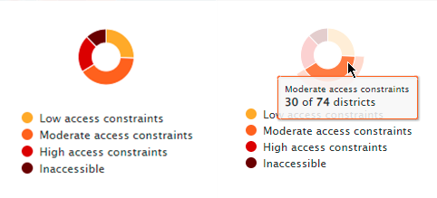

# User Tutorial

> RIR: Risk-Informed Response

The RIR platform is a situational awareness platform to monitor health, child protection, nutrition, water, sanitation, hygiene, and education in a geographic region. This section will explain how the RIR platform works so that you can fully understand the platform and the information you can obtain from it.

## Working with this documentation

Whenever you see a phrase in **bold**, it refers to a link or button on the user interface that you can interact with.

## Session outline 

This session will tour the RIR platform functionality using simple examples and workflows that the everyday platform user would use.

### Important Links:

* [RIR Platform](https://staging.rir.kartoza.com/ "RIR Platform")
* [RIR Full Documentation](https://kartoza.github.io/rir-dashboard/pages/introduction.html "RIR Full Documentation")

### Session breakdown diagram: 

Here is a simplified overview of the topics we will cover in this session:

During this tutorial, we will complete the following activities:

### Activity: Overview / Course Outline

In the section, we will show you how to navigate the platform and summarise what each tool and button does. We will include simple examples and workflows. You can find more self-study content in the full system documentation here: [Platform Tour](https://kartoza.github.io/rir-dashboard/pages/using/platform_tour.html)).

1. Access and **Sign In** to the platform and **Links** menu.
2. **Programme Interventions Panel**: We will explore the group of buttons used to navigate through the program intervention plans that have been created for each scenario.
3. **The Indicator Panel:** We will show you how the list of indicators can be used to explore data in the platform (full documentation here: [Indicators](https://kartoza.github.io/rir-dashboard/pages/using/indicators.html#indicators)).
4. **Hiding and showing panels:** We will show you how to hide and show different content areas around the site so that you can focus on the information that is most important to you.
5. **Layers**: (see also [Layers](https://kartoza.github.io/rir-dashboard/pages/using/layers.html#layers)). We will look at these layer related topics:
    ◦ The **Layers Icon**  
    ◦ The **Basemap Icon**
    ◦ **Geography Level Panel**: This panel allows you to view the area of interest at a country, region, and district geography level. 
6. **Map:** (see also [Map Interactions](https://kartoza.github.io/rir-dashboard/pages/using/map_interactions.html))
    ◦ Panning/ moving around the map 
    ◦ Zooming in and out
    ◦ The information display window 
    ◦ The map slider (eg. to compare people in need of 'Child Protection' vs. 'Child Protection Program Coverage') 
    ◦ Timelaps (eg. IDP arrival over time) 
7. The **Info Button** 
8. Infographics
9. Questions 

## Activity: Tutorial

### Accessing the platform

You can access the platform here: https://staging.rir.kartoza.com: 

> Note this link will change in the future. We will advise all users of the system when that happens.

### Documentation

On the top right-hand side of the landing screen, there is a drop-down menu for **Links** and a link to a sign-in page. The **Links** drop-down menu is a quick way to access the documentation for using the platform and the different data and resources associated with the platform (which are not covered in this tutorial).

> **Instructor note:** Briefly show the documentation and how to navigate it.

### Instances

On the landing page, you will see several **instances**. An Instance is a configured dashboard for a specific region or country. We will use the Somalia instance for the examples in this tutorial.

### Signing In

Return to the RIR platform, click on the **Sign In** link, and a page will open where you can add in your user name and password. Your credentials are created for you by an administrator and may not be necessary. As a web user, you will still be able to interact with the platform without a login.

**Sign In** is only important to access specific workflows. Some data and workflows may only be available to named users who are signed into the platform. Once you are signed in to the platform, your name will appear on the top right and depending on your admin privileges, there will be a drop-down with the option to log out and reach the admin page if you are an administrator. 

### The Somalia Dashboard

Click on the instance labelled Somalia, and the dashboard will load and open. 

You will see I am still signed in, and there are three options available to me on the bottom left. If I sign out, these buttons will disappear because web users do not have access to some functionality. For this tour, a web user status will work.

### Dashboard Tour

Let's tour the dashboard together. We will start from left to right across the screen, showing what each button and panel does with a few simple examples. 

**The Context Analysis Button**

At the top left of the screen, you will see the **Context Analysis Button**. This button gives access to the **Indicator Panel** it is selected, and the is panel open by default.

Below the **Context Analysis Button** is the **Programme Interventions Panel** panel. It contains a set of buttons that allow access to key risk response indicators. If you click on the arrow next to the house symbol, the tabs will extend and be labelled so you can see what each symbol means, Health, Child Protection, Nutrition, Wash, and Education.

For example, the second button-down with a picture of the caduceus/ medical symbol indicates **Health**. Once opened the panel shows a report on the status of or degree to which the intervention for that factor is helping and other information like costing.
 
Click on each button to see the information for each factor. 

**The Indicator Panel**

Click back on the **Context Analysis Button** and observe the **Indicator Panel**. This panel contains a list of indicators (special layers) that relate to the main factors on the platform like health and nutrition. The panel is expanded by default but can be collapsed if you click on the tab labeled with a house on the right side of the panel to observe the map better. 

Open the drop-down for **People In Need** by clicking on the triangle next to the label and selecting the box next to the **PIN- Child Protection**. A tick will appear and you will see the layer appear on the map. The map shows darkening color of blue, indicating a decrease in child protection per region. You can select only one sub-sections (e.g. best-case or worst-case) of the layer by ticking or un-ticking the checkboxes next to the cases. An **Information panel** will also open on the right-hand side of the screen when an indicator is selected. We will go through the **Information Panel** in more detail shortly. 

The coloured circles next to each indicator show the current severity level for that indicator. Blue is the best case, yellow mid, and red is the worst case. The case scenario will indicate if that region or state needs additional responses or interventions. 

**The Traffic Light**

You can access what we call traffic lights for the indicators by clicking on the arrow in the top right of the panel. This will expand the information on the severity level, for example, you can see that for our selected layer of **PIN- Child Protection** overall in Somalia the situation is worsening for children hence the yellow color. Several regions need additional responses or support to protect vulnerable children. Click the triangle (now on the top right) again to see the map again. 

**The Information Panel**

On the right-hand side of the map, the **Information Panel** shows the severity case of the indicator for each region or district. For example in Adan Yabaal Child protection has a value of 3. Your will also see an interactive pie chart infographic summarising all the data in the layer. 

If you click on the region name in the **Information Panel** it will show which region it is with an information window on the map. Once a single district is selected and the ** Information Panel** will show all the indicators for that specified region and the severity of the situation for each indicator using colors. You can click on each indicator for more detail like Child protection and you will see more information and a infographic. We will cover the **Information Panel** more fully in the **Information Panel** section below.

**Downloading Data**

You can download the data of interest by clicking on the round symbol with the download arrow in it next to each indicator in the **Indicator Panel** or at the top of the **Information Panel** for the selected indicator. You can get all the data for the instance if you click the download the symbol at the top of the **Information Panel**. This will give you a spreadsheet of the information that you can use outside of the platform. 

### Layers

Let's explore the layers available to visualize and give context to the indicators. 

**Context Layers**

The **context layers** can be accessed by clicking on the button with 3 overlapping squares on it. There will be a list of options to choose from. 
Select ‘Access’ We can now see all the roads, airports, and other access indicators. If you click on the drop-down triangle you can choose exactly what features you want to see.
Turn off everything except roads and ports. If you click on a point like a port you will be given information about that specific point in an **Information Panel**. 

**Base Maps**

You can also change the base map behind the data if you click on the world icon in the panel. The default is an OpenStreetMap canvas. There is also a GEBCO grid base map which is a global terrain model for ocean and land, a Mapbox satellite base map, and an open topo base map which is rendered from OSM and SRTM data.

For example, it may be useful to have a topographic map to visualize geographic features like mountains and rivers that could impede people's movement into areas if you are reviewing the internal displacement of people. 

- turn on the Open Topo Map
- Navigate back to the indicator panel
- Uncheck the child protection layer. 
- Click the drop-down for Internal Displacement
- select the IDP Departure layer

You can now see some of the topographic features underneath the departures layer. 

**Geography Level**

Finally, while we have the IDP data handy you can change the **Geography Level** of the indicators. By specifying country region or district in the menu on the bottom right of the map canvas.

- Turn off the Acess layer by going to the layers and unchecking it so that we can see the regions better
- On the menu at the bottom right of the page select Region you will see that the geographic level of the areas changes. 
- click on Country and see what happens. 

### Map Interactions

Let's now get into actually interacting with the Map. Activate the child protection indicator again (and deactivate departures). 

**Zooming**

You can zoom into and out of the map by using your scroll wheel on your mouse or you can click hold down shift and draw a square around the area you wish to zoom in on. 

**Panning**

To pan on the map just click on the map and drag it around. 

**Information Window**

Once you have zoomed and panned to an area of interest click on it and you will see an information window as we saw earlier. For more information click on the detail button and information will be shown in the ** Information Panel** on the right. Click off the window to get out.

**The Slider**

You can choose two indicators for comparison on the map. For example, while child protection is selected let's see where there is program coverage for child protection in Somalia. 

Under the  Program Coverage indicator select the child protection option. You will see a slider appear and the layer names represented on each side on the bottom left and right of the screen. 

If you click on the middle toggle and drag you can see that in several of the regions in the north with the worst-case scenario for child protection there are no active programs to combat the issue depicted in red. These would be ideal candidates to fund child-releaf projects in. 

You can make the sliding horizontal by clicking the map button at the bottom right of the map canvas. 

**Time Laps**

There is a time laps bar that can show changes in data over time. A great example of this is the internal displacement of people. Turn off the child protection indicators and activate the IDP layer for departures. You can see where indicators are selected because the tab heading will be bolded. 

Now click the play button on the time bar and you will see the changes in what region people are leaving over time. People will leave due to conflict, drought, and other reasons. This is also interesting to compare to IDP arrivals using the slide bar to see where people are leaving and what regions they are going to who may need extra financial and technical support. 

### More on Information Pannel

While the IDP Departures is open, let's look at the last options and functionalities on the information panel that we did not cover previously. If the Information panel in minimized or you want to minimize it. Click on the blue Info button that looks like a tab on the right-side panel to maximize and minimize it. 

Inside the information panel, there is a summary of all the region/or districts and for example how many people departed that area because we are looking at the departures layer. 

**Graphical Representation**

There is also a graphical representation of the scenarios in this case a pie chart showing the proportion of best-case regions to worst-case and the status quo. You can hover your mouse over the chart and interact with it. For example, it will show that the best case is the reality for 54 out of the 73 districts in a pop-up label. 

Further click on the name Adan Yabaal and in the Indicators select IDP departure.
This will open the details panel where you can see a line graph showing the change over time for the Adan Yabaal district as well as other pertinent information. 

### Bringing it all together

With your knowledge of the RIR dashboard try an analysis where we look at what districts people are departing from and what districts they are arriving to. 

- Make the context map OpenStreetMap
- Add the context layer Refugees and IDPs
-  activate both the arrivals and departures indicator layers
-  click on different districts and observe the detail in the information panel
-  slide the slider to see if neighboring districts accept departing people, thus having higher arrivals than previously observed. (see the linear graphs to compare)

Answer the following questions:
- what regions have the highest number of departures?
- What regions have the highest number of arrivals? 
- what region has had the most changes in departures over time? 

