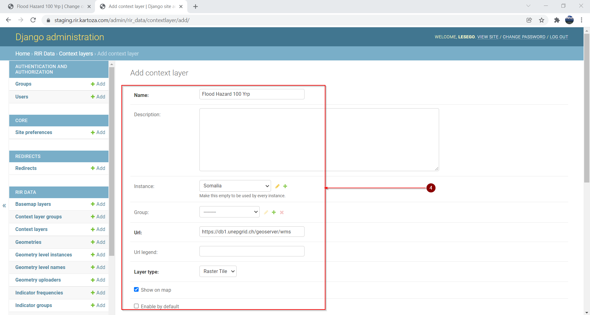
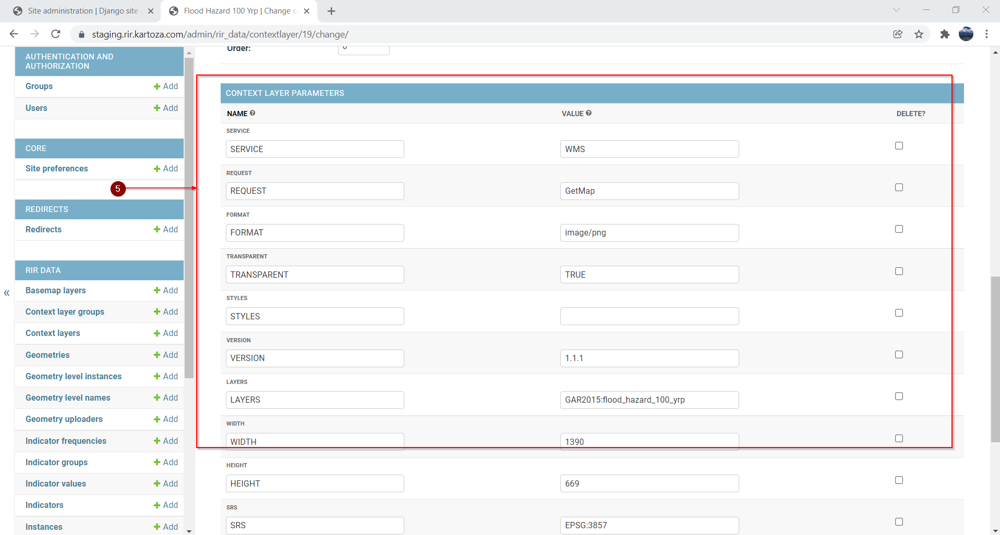
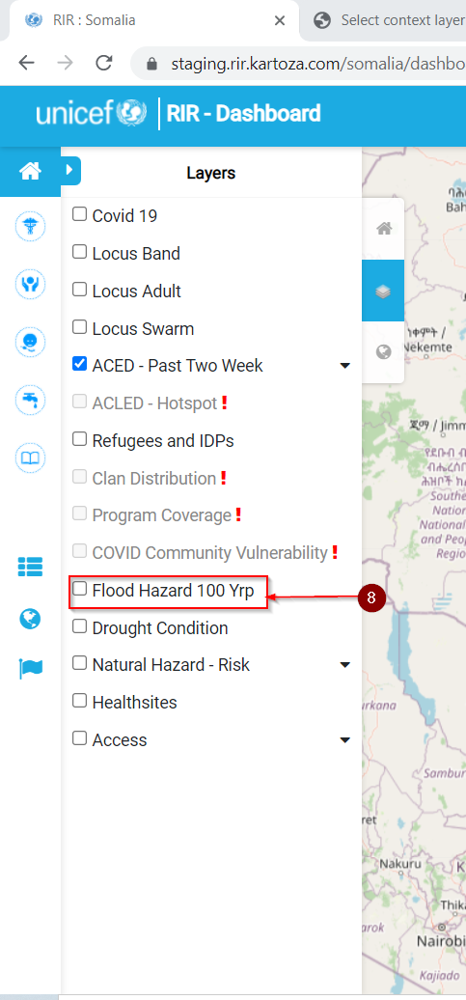

# Context layers

## Adding a new Context layer

### How to add a new context layer

Once you have logged in and opened an instance:

1. Click on the user dropdown menu

2. Open Django Admin

3. Click on Add on the Context layers line

We will use the existing Somalia instance and Flood Hazard layer as an example. The layer shows areas that are prone to flooding

4. Enter information in the input boxes as shown in the images below

5. Once the data has been entered click Save to save the selection

6. Click on VIEW SITE to see the new layer

7. Click on the layers icon to open the layers menu

8. The new Flood Hazard 100 Yrp layer has been added. Check the checkbox of the Flood Hazard 100 Yrp layer to make it visible

9. The output is shown in the image below. You can toggle the cheking of the layer to make it visible or invisible

 

