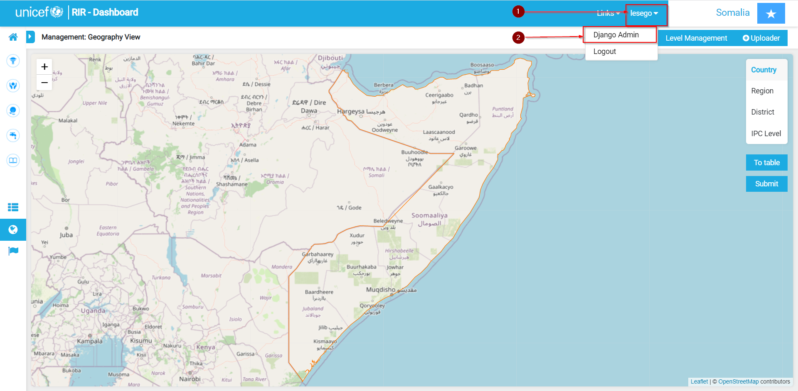

# Context layers

## Adding a new Context layer

### How to add a new context layer

Once you have logged in and opened an instance:

1. Click on the user dropdown menu

2. Open Django Admin

3. Click on Add on the Context layers line

