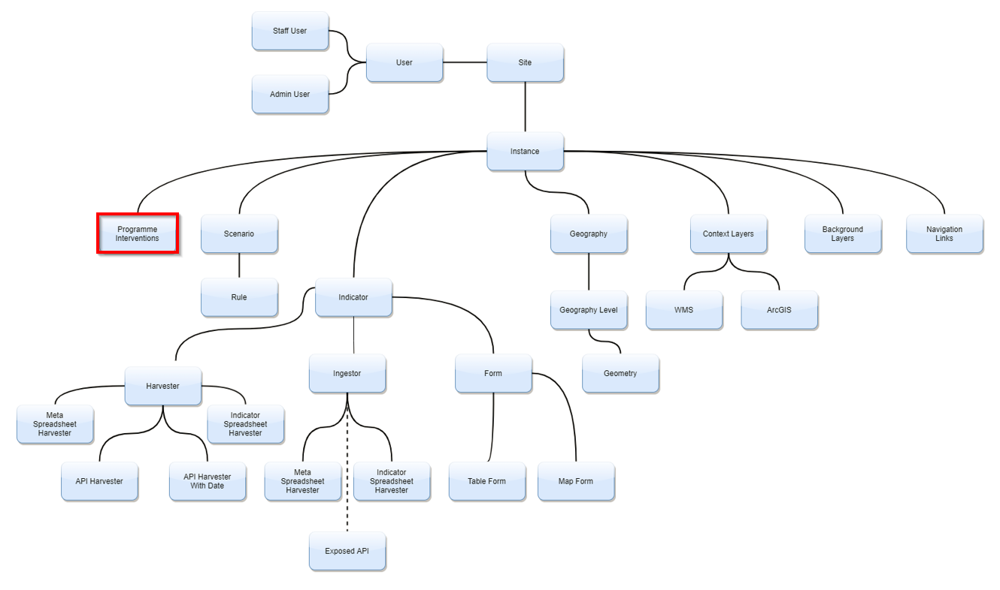
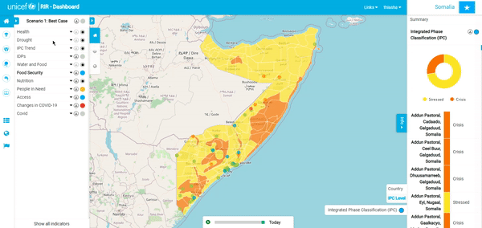
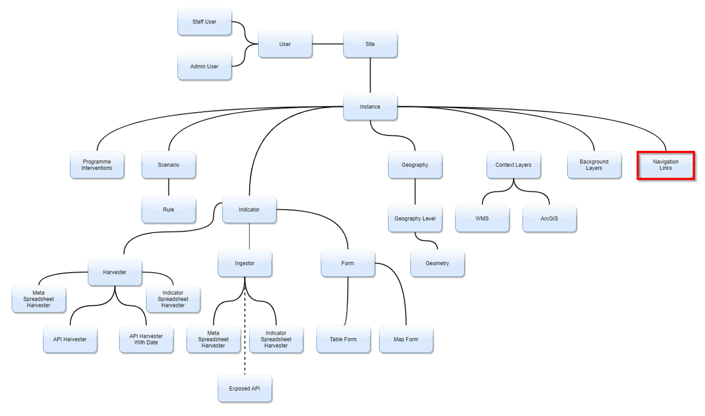
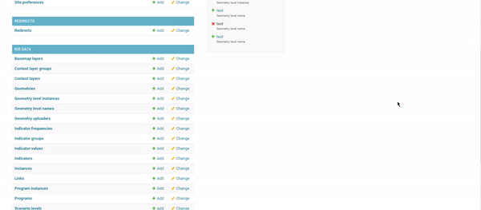

# **Instances and Program Interventions**

1. **Signing In**:
In the top right-hand corner of the screen is the sign-in button. Here, you will sign in using your admin username and password. This process is the same for a staff user 
and an admin user. 
> 

2. **Users and Permissions**:
>
Go to site administration. “click” on ‘+Add’ in the same row as ‘Users’. You can now create a profile for someone by adding a username and password. Once you have created the user profile, “click” ‘Save’.
>
 
 >
>
Once you have created the user account, go back to ‘Site Administration’ and “select” the ‘user’ option. “Select” the user you created and then you can edit their personal information as well as select or deselect their ‘Permissions’. Remember to ‘Save’ your changes. 
>
 

> 
> 
3.  **Creating an instance**: 
Once you’ve signed in, you’ll be redirected back to the home page which contains the various instances that you can select. To create a new Instance, select the
dropdown arrow next to your username and “click” on ‘Django Admin’. Once you’re on the ‘Site Administration’ page, “scroll” down until you find ‘Instances’. 
“Click” on the ‘+Add’ option on the right-hand side of the ‘Instances’ row. “Add” the name of the new instance, a description as well as the icon files 
and then “click” ‘Save’.
> 

4. **Adding or Changing Icons**:

If there is an 'Instance' with no image available or you would like to change the current icon, follow these steps: start by selecting the dropdown arrow next to
your username and “click” on ‘Django Admin’. Once you’re on the ‘Site Administration’ page, “scroll” down until you find ‘Instances’. “Select” the instance 
you would like to change and then “insert” the files for the ‘Icon’ and ‘White Icon’ of your choice. Once you’re happy with your selections, “click” ‘Save’.
> 

> 
> 
To change or add icons to the 'RIR dashboard panel' at the top of the screen, you will need to go to the 'Site Administration' page. Under the group 'Core',
you will see ‘Site Preferences’. “Click” on this option and then you will be redirected to a new page, “select” ‘Site Preferences’ again. Here you will be able
to “change” or “edit the title as well as the icons. “Save” and “refresh” once you have made your edits.
> 

>

> 

5. **Program Interventions**:
>
The process of changing or adding ‘Program Interventions’ icons is similar to what we have been doing previously, except for this time once we are on the 
‘Site Administration’ page, “select“ ‘Programs’.  You will now have the option of choosing a specific program intervention. “Click” on the one you want to edit.
You can add or change the title, description, or icons. “Select” ‘Save’ once you are happy with your edits.
> 

> 
>

>
>
6.	**Navigation Links**:
>
To add links to the RIR platform or a specific instant, go to 'Django Admin' and "click" on RIR data. "Select" 'Links' and fill out the necessary information.
If you leave the instant option blank, the link will show in 'Navigation' for all instances. If you select an instance, the link will only appear in 'Navigation'
for that instant.
>
  
>
>
 
>
>
7.	**Scenario**:
>
To add a scenario level or change a scenario level, go to 'Django Admin' and "click" on Program Instances'. To change the referral scenario for the instance, "select" 'Scenario level' from hat admin page.
>
  
>
