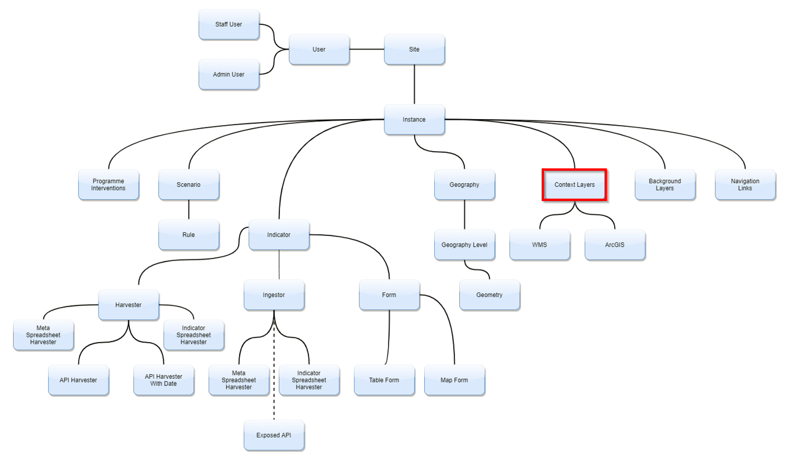

# **Layers**

To add any type of layer to the dashboard, you need to push the data from an online server. To do this you will first need to upload the data to GeoNode or GeoServer
as well as a styled layer descriptor file (SLD). Let’s start by creating the SLD in QGIS. Once you’ve opened QGIS or the mapping software of your choice, upload the 
data to your canvas as you would normally do. Once the layers are added, use the ‘Layer Styling’ panel to create an appropriate style for the data. You want to follow
the general theme of the layers that are already on the dashboard. Once you are happy with the style “right-click” on the layer and “select” ‘Properties’. 
Go to ‘Symbology’ and “click” on the drop-down ‘Style’ button. “Select” ‘Save Style’. “Click” on the ‘Save Style’ drop-down option and “select” ‘As SLD Style File’.
“Click” on the ellipse on the right-hand side of the ‘File’ line to choose a place to save the SLD. Do this for each file you want to upload.
       
Now we’re going to upload it to GeoNode. Log into your GeoNode or GeoServer account. “Click” on the ‘Data’ dropdown. “Select” ‘Upload Layer’. Please note that
you can only upload one layer at a time. “Drop” all the data for the layer into the grey box and “select” ‘Upload files’.   
   
Once the data has uploaded, “click” on ‘Edit Metadata’. “Fill” in as much of the metadata information as you have and then “click” ‘Return to Layer’.  
    
“Click” on ‘Editing Tools’. “Click” on ‘Upload’ under ‘Styles’. “Choose” your SLD file and then return to layer once again. In ‘Editing tools’ you can also
change the thumbnail for the layer by uploading a screenshot of the layer.  
   
“Right-click” on the layer and “Select” ‘Inspect’. “Select” ‘Network’ and hard refresh the page. “Select the web address for a tile from the layer
(usually the third option) but if you click on the address, you’ll be able to see if it is the right one).  
    
Copy the link address and paste it into a notepad. Use the first part as the URL when adding a new layer. The rest of the address needs to be broken down and added as layer parameters.  
For example, if the link address is:
https://staging.osgs.rir.kartoza.com/geoserver/owsaccess_token=EybMy8jdEBc7ugrIAyzAP6sImNlOEk&LAYERS=geonode%3ADrought_Priority_Areas_Affected_Population&TRANSPARENT=TRUE&SERVICE=WMS&VERSION=1.1.1&REQUEST=GetMap&STYLES=&FORMAT=image%2Fpng&SRS=EPSG%3A900913&BBOX=5009377.085,0,6261721.35625,1252344.27125&WIDTH=256&HEIGHT=256, 
the URL you need to use is https://staging.osgs.rir.kartoza.com/geoserver/ows. Your parameters are TRANSPARENT=TRUE, VERSION=1.1.1, WIDTH=256, HEIGHT=256, etc. 
and your token would be EybMy8jdEBc7ugrIAyzAP6sImNlOEk.  
   
This was how to upload a context layer but the process of pushing data and creating the SLD file would apply to manually add any layer to the dashboard.

 

1.	**Adding a Background Layer**:
To add a background or basemap layer, “click” on ‘Django Admin’ and go to the ‘Site Administration page. “Click” on ‘+Add’ in the ‘Basemap Layers’ row. This will allow you
to create a basemap by linking it to a URL as well as the instant you would like it to apply to. 
   
You will also be able to add the parameters to the basemap by scrolling down to ‘Basemap Layer Parameters’ and clicking on the green plus that says ‘Add Another 
Basemap Layer Parameter’.
  
 

2. **Adding a new Context layer**
"Click" on the user dropdown menu and open 'Django Admin'. "Click" on '+Add' on the 'Context layers' line. "Select" the instance you would like to add the context layer to.
We will use the existing Somalia instance and Flood Hazard layer as an example. The layer shows areas that are prone to flooding. Enter information in the input boxes as 
shown in the images below and save your data once you are happy with it. "Click" on veiw site to see your new layer. You will be able to see your new layer in the 'Layers' menu. There is also an option to add other parameters to this layer. 
  

