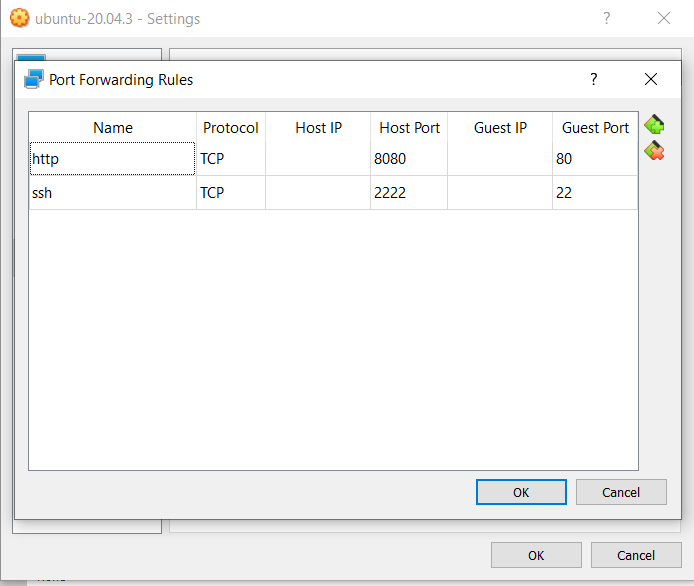

# Preparing the server

## Basic Requirements

### You should be running a linux ubuntu server on your machine or on a virtual box

Ensure that you have set your unique login username and unique password

Start the server and login

### Install make dependency

This will install make on your machine or virtual box server

```
sudo apt install make       # version 4.2.1-1.2       
```

### Install docker-compose

This will install docker-compose on your machine or virtual box server

```
sudo apt install docker-compose       
```

### Run apt update

This will run apt update
```
sudo apt-get update       
```
### Run apt install

This will run apt install
```
apt install \
ca-certificates \
curl \
gnup \
lsb-release
```

### Download docker

This will download docker 

```
curl -fsSL https://download.docker.com/linux/ubuntu/gpg | sudo gpg --dearmor -o /usr/share/keyrings/docker-archive-keyring.gpg     
```

On the next prompt line:

```
echo \
"deb [arch=$(dpkg --print-architecture) signed-by=/usr/share/keyrings/docker-archive-keyring.gpg]https:download.docker.com/linux/ubuntu \
$(lsb_release -cs) stable" | sudo tee /etc/apt/sources.list.d/docker.list > /dev/null
```

Run apt update:

```
sudo apt-get update
```

### Install docker

This will install docker
```
sudo apt-get install  docker-ce-cli containerd.io
```

### Check if installation was successful

This will check if installation of docker was successful
```
sudo docker run hello-world
```

### Clone rir-dashboard repository to your machine

This will clone the rir-dashboard rpository to your machine or virtual box
```
git clone https://github.com/kartoza/rir-dashboard.git
```

### Set up server

This will set up the rir-dashboard server on your machine or virtual box
```
cd rir-dashboard
cd deployment
ls
cp docker-compose.override.template.yml docker-compose.override.yml
cp .template.env .env
ls
cd ..
make up
docker ps
docker logs -f rir_dashboard_django
```

### Open server if using a linux machine

This will open the dashboard on a webpage:

Open up a web browser and go to 127.0.0.1 and the dashboard will open:


### If using a virtual box

Open network settings of your virtual box


Click on port forwarding and add 2 new rules as indicated in the image below:



Click OK and close. Download [PuTTY](http://www.chiark.greenend.org.uk/~sgtatham/putty/latest.html).
Create a connection by following these [directions](https://the.earth.li/~sgtatham/putty/0.67/htmldoc/Chapter2.html#gs-insecure), enter “localhost” as the host name, “SSH” as the protocol, and “2222” as the port.

Once you have logged in on PuTTY enter this command below in the prompt: 
```
ssh yourlogin@127.0.0.1 -p 22
```
(Make sure that you replace your username with "yourlogin")

When asked for your password, press enter three times and the prompt will display this message:  Permission denied (publickey,password).
 

Open the RIR dashboard server using a web browser on your machine by going to 127.0.0.1:8080


### Signing in

Click on Sign in and for username and password type admin

Change your password on the Django admin page

Currently the dashboard is just a template and the working RIR Dashboard has not been setup yet


